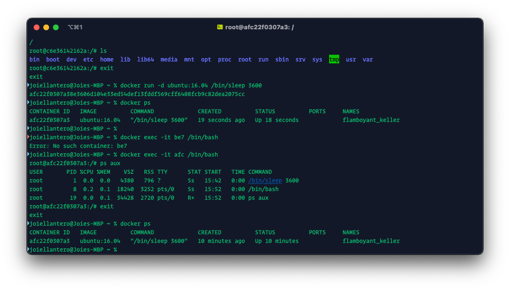

# Exercise 1: Running Our Container

1. Running `docker run`

2. Cheking the containers after running `docker run`

* Running `docker ps` and `docker ps -a`

3. Running the `/bin/bash` command

* Running `docker run ubuntu:16.04 /bin/bash` then `docker run -it ubuntu:16.04 /bin/bash`

4. Running indetached mode

* Running `docker run -d ubuntu:16.04 /bin/sleep 3600` and checking if it's running the sleep command in a new container.

5. Reattaching to the container.

* Running `docker exec -it be7 /bin/bash` then `ps aux`

6. Stopping the Docker container.

* Running `docker stop afc`

7. Removing the containers

* Running `docker rm afc2` and `docker rm $(docker ps -a -q)` to remove the remaining containers

